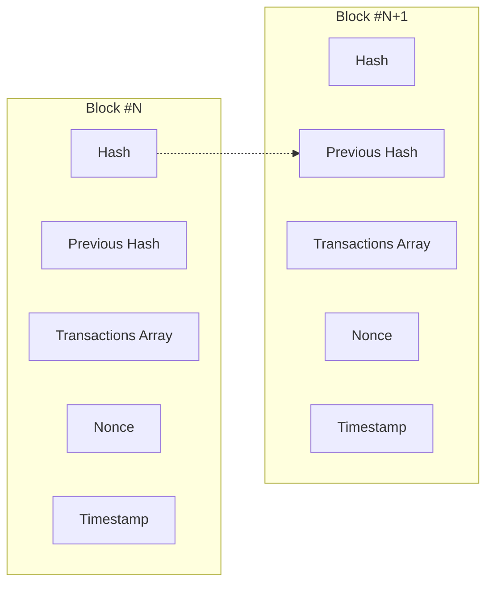
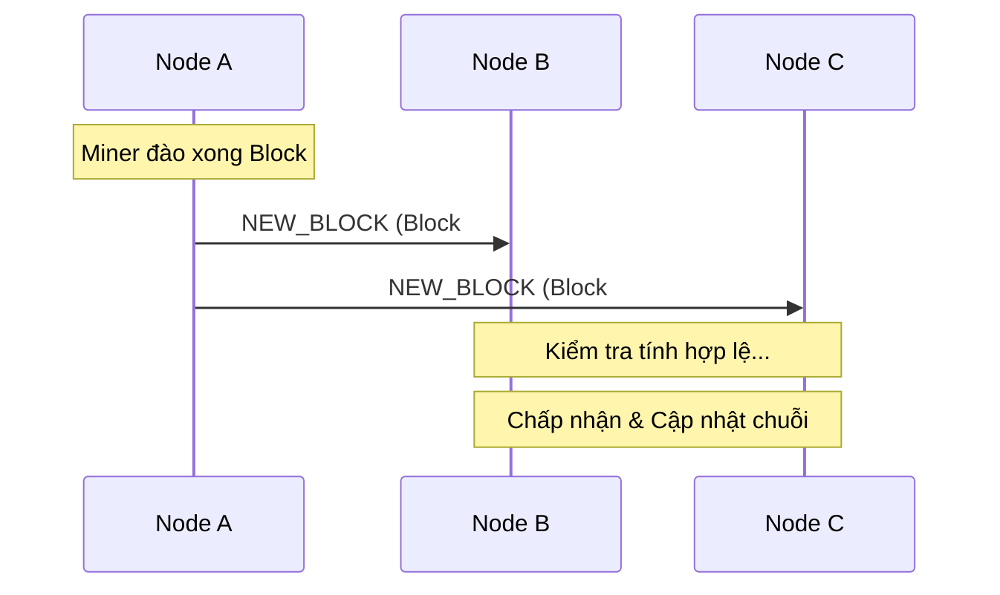

# 📑 BÁO CÁO CHUYÊN SÂU: HỆ THỐNG MINI BLOCKCHAIN SIMULATION v3.0

Tài liệu này được thiết kế để cung cấp cái nhìn toàn diện và chuyên sâu về mặt kỹ thuật cho buổi báo cáo thuyết trình. Nội dung tập trung vào kiến trúc hệ thống, các cơ chế bảo mật cốt lõi và quy trình vận hành mạng lưới P2P.

---

## 🏗️ 1. Kiến Trúc Hệ Thống (Architecture Overview)

Hệ thống được xây dựng theo mô hình **Phân tán (Decentralized)**, mô phỏng cách thức hoạt động của Bitcoin và Ethereum trên một quy mô nhỏ.

### 🧩 Các thành phần chính:
1.  **Core Blockchain Engine (Node.js)**: Quản lý logic chuỗi, khối và giao dịch.
2.  **P2P Network (WebSockets)**: Giao thức truyền tin thời gian thực giữa các nút (nodes).
3.  **API Layer (Express.js)**: Cung cấp giao diện tương tác cho Frontend và các ứng dụng bên thứ ba.
4.  **Frontend Dashboard (Bootstrap 5)**: Hiển thị trực quan trạng thái mạng, ví tiền và chuỗi khối.

### 📊 Sơ đồ cấu trúc Block:

---

## 🛡️ 2. Các Cơ Chế Bảo Mật Cốt Lõi

Đây là phần quan trọng nhất để giải thích tại sao Blockchain "không thể bị hack".

### 2.1. Tính Bất Biến (Immutability) qua Hashing SHA-256
- **Cơ chế**: Mỗi block chứa mã hash của chính nó, được tính toán từ toàn bộ dữ liệu bên trong (index, timestamp, transactions, previousHash, nonce).
- **Liên kết**: Block sau lưu mã hash của block trước (`previousHash`). 
- **Hệ quả**: Nếu dữ liệu ở Block #1 bị sửa dù chỉ 1 bit, mã hash của nó sẽ thay đổi hoàn toàn. Điều này khiến `previousHash` ở Block #2 không còn khớp, phá vỡ toàn bộ các liên kết phía sau.

### 2.2. Chữ Ký Số (Digital Signatures - ECDSA)
- **Thuật toán**: Sử dụng đường cong Elliptic `secp256k1` (chuẩn của Bitcoin).
- **Quy trình**:
    1.  Người dùng dùng **Private Key** để ký vào mã hash của giao dịch.
    2.  Hệ thống dùng **Public Key** của người gửi để xác minh chữ ký.
- **Bảo mật**: Đảm bảo rằng chỉ chủ sở hữu ví mới có quyền chuyển tiền. Không ai có thể giả mạo giao dịch của người khác.

### 2.3. Bằng Chứng Công Việc (Proof of Work - PoW)
- **Bài toán**: Tìm một giá trị `nonce` sao cho mã hash của block bắt đầu bằng một số lượng số "0" nhất định (Độ khó - Difficulty).
- **Mục đích**: 
    - Ngăn chặn thư rác (Spam) giao dịch.
    - Làm cho việc sửa đổi dữ liệu quá khứ trở nên đắt đỏ một cách không tưởng (vì phải đào lại toàn bộ các block sau đó).

---

## 🌐 3. Mạng Lưới Ngang Hàng (P2P Network) & Đồng Thuận

Hệ thống không có máy chủ trung tâm. Mọi node đều bình đẳng.

### 3.1. Lan tỏa thông tin (Broadcasting)
Khi một sự kiện xảy ra (Giao dịch mới hoặc Block mới được đào), node đó sẽ gửi thông báo qua **WebSocket** tới tất cả các peer đang kết nối.
- **Giao dịch**: Được đưa vào **Mempool** (Hàng đợi) của tất cả các node.
- **Block mới**: Khi một node đào xong, nó thông báo để các node khác cập nhật chuỗi.

### 3.2. Cơ chế Đồng thuận (Consensus - Longest Chain Rule)
Nếu có hai chuỗi khác nhau tồn tại trong mạng, hệ thống sẽ áp dụng quy tắc **"Chuỗi dài nhất là chuỗi hợp lệ"**.
- **Lý do**: Chuỗi dài nhất đại diện cho nỗ lực tính toán (Proof of Work) lớn nhất từ mạng lưới.
- **Xử lý xung đột**: Các node sẽ tự động thay thế chuỗi của mình bằng chuỗi dài hơn nhận được từ peer, nếu chuỗi đó hợp lệ.

---

## 💸 4. Ngăn Chặn Chi Tiêu Kép (Double Spending Protection)

Đây là bài toán kinh điển trong tài chính kỹ thuật số mà Blockchain giải quyết triệt để.

- **Vấn đề**: Người dùng gửi cùng 1 số tiền cho 2 người khác nhau cùng lúc.
- **Giải pháp của chúng ta**: 
    1.  **Kiểm tra số dư trên chuỗi**: Tính toán từ lịch sử giao dịch.
    2.  **Kiểm tra Mempool-aware**: Trừ đi các khoản tiền đang nằm trong hàng đợi chờ xác nhận.
    - Nếu `Số dư - Tiền đang chờ < Số tiền gửi mới`, giao dịch sẽ bị từ chối ngay lập tức.

---

## 🚀 5. Kịch Bản Demo Ấn Tượng cho Buổi Thuyết Trình

Để thuyết trình mượt mà, hãy thực hiện theo các bước này:

1.  **Khởi tạo danh tính**: Tạo ví trên Node 1 và Node 2. Copy Public Key.
2.  **Giao dịch thời gian thực**: Gửi tiền từ Node 1 sang Node 2. Cho khán giả thấy Mempool ở cả 2 node cập nhật cùng lúc (Sức mạnh P2P).
3.  **Khai thác (Mining)**: Nhấn Mine ở Node 1. Giải thích về độ khó và phần thưởng thợ đào (Incentive).
4.  **Tấn công giả mạo (Tamper)**: Sửa đổi dữ liệu ở Block cũ. Nhấn Validate để hệ thống báo đỏ. Giải thích về tính bất biến.
5.  **Tự động khôi phục**: Nhấn "Đồng bộ mạng lưới" để lấy lại chuỗi đúng từ các node khác. Chứng minh tính tự phục hồi của mạng phi tập trung.
---

## 🛠️ 6. Các thông số kỹ thuật (Tech Stack)
- **Backend**: Node.js v16+, Express, Axios.
- **P2P**: WebSockets (ws library).
- **Cryptography**: Crypto-JS (SHA-256), Elliptic (secp256k1).
- **Frontend**: HTML5, CSS3 (Glassmorphism), JavaScript (ES6+), Bootstrap 5.

---
*Chúc bạn có một buổi báo cáo thành công rực rỡ! Hệ thống này là minh chứng rõ ràng nhất cho sự kết hợp giữa thuật toán mã hóa và mạng lưới phân tán.*
